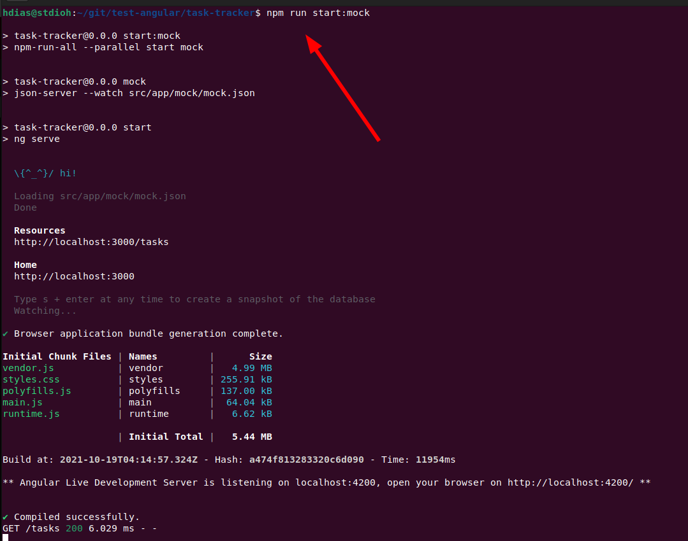
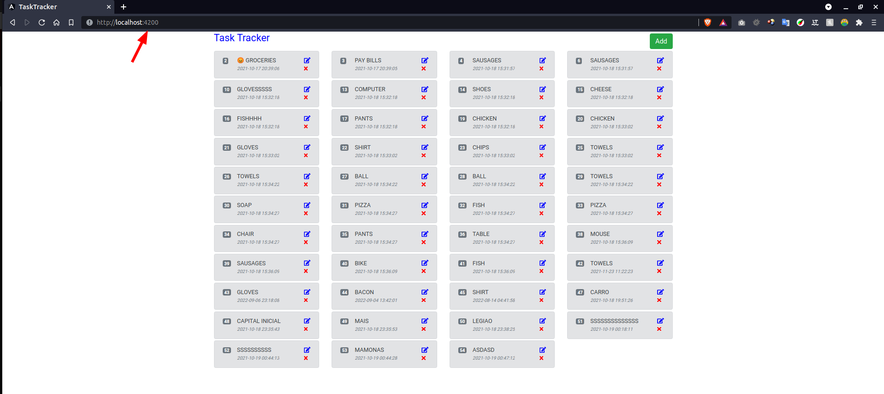
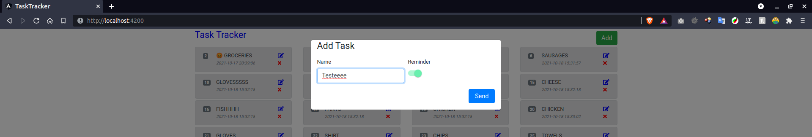
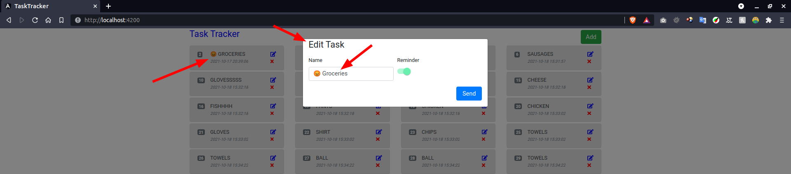
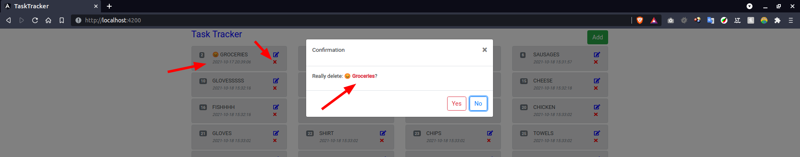
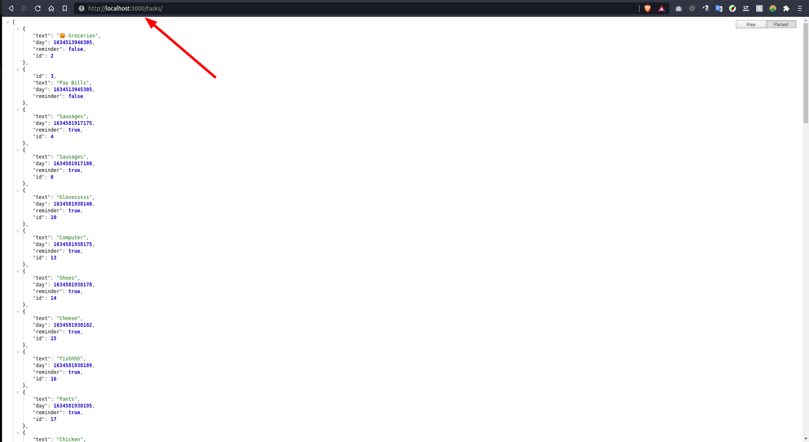

# Task Tracker
Task Tracker


# Requirements
* [Node/Npm](https://nodejs.org/en/download/)
* [Angular](https://angular.io/guide/setup-local)
* [Angular Cli](https://angular.io/cli)


# Setup
```sh
git clone https://github.com/stdioh321/test-angular.git
cd task-tracker
npm install
```

# Run
```sh
npm run start:mock
```
The application will run at the port **4200** and the server at **3000**.

Open your browser at:
**http://localhost:4200**

and at:
**http://localhost:3000/tasks**

|Terminal|Index|
|:--|:--|
|||

|Add|Update|
|:--|:--|
|||

|Delete|Json-Server|
|:--|:--|
|||


# References
* [Tutorial Youtube](https://www.youtube.com/watch?v=3dHNOWTI7H8)
* [ngrx](https://ngrx.io/guide/store)
* [ngrx advanced](https://ngrx.io/guide/store/walkthrough)
* [ngrx Youtube](https://www.youtube.com/watch?v=GSc1fHXVBGg)
* [NgBootstrap](https://ng-bootstrap.github.io/#/components/accordion/examples)
